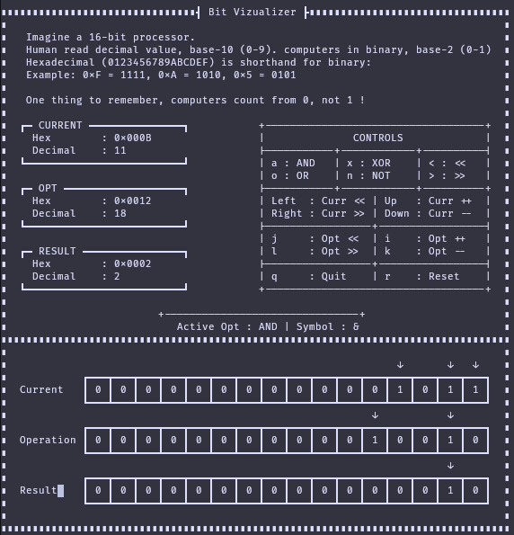

## BitViz — Binary Visualizer

BitViz is a small terminal-based program for **learning and teaching binary operations** interactively.  
It visualizes how bitwise operations work at the **bit level**.

Designed to be simple and fun.
It should work on **Linux, macOS and BSD** (Unix-based)

> Note: This program uses **ncurses**, so it will not work in terminals without proper TUI support.



---

## Why?

Humans usually think in **decimal (base-10)**.  
Computers operate in **binary (base-2)**.

BitViz bridges that gap by showing:

- Decimal value
- Hex value
- Actual **bit layout**
- Result of bitwise operations in real time

It also reinforces an important rule:

> **Computers count from 0, not 1.**

## Build

```sh
cc bitviz.c -o bitviz -lncurses
#or
gcc bitviz.c -o bitviz -lncurses
#or
clang bitviz.c -o bitviz -lncurses
```

## Run

```sh
./bitviz

```

